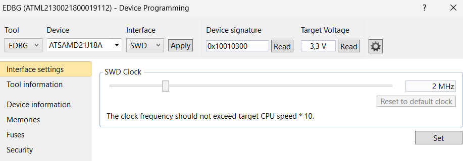
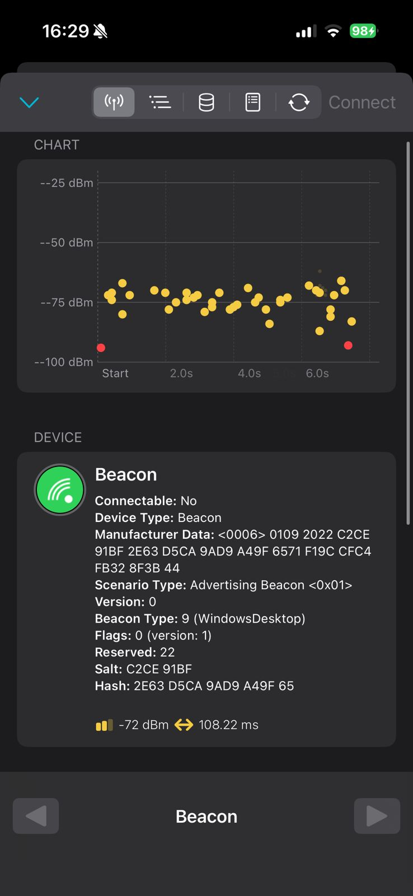

Teste BLE iBeacon — SAMD21 Xplained Pro + BTLC1000 Xplained Pro

Hardware
- Base: **SAMD21 Xplained Pro (ATSAMD21J18A)**
- Extensão: **Atmel BTLC1000 Xplained Pro (ZR/MR)** — instalada no **EXT1**
- Alimentação: USB **DEBUG** (EDBG)

Software / Ambiente para estudo
- **Microchip Studio 7** (ex-Atmel Studio) + **Device Pack SAMD21**
- **BluSDK / ASF** com exemplo **iBeacon**
- Terminal serial (TeraTerm/PuTTY) a **115200 8N1**
- App iOS: **nRF Connect**
- Versões exatas em [`env/versions.txt`](env/versions.txt)

Procedimento executado

Criei o projeto iBeacon com os seguintes passos
1. File → New → Example Project…
2. Buscar por **iBeacon** e selecionar a variante para **SAMD21**

*(screenshot da interface/clock do EDBG)*  

Copilei e gravei
1. Build → Build Solution
2. Tools → Device Programming → **EDBG**, **ATSAMD21J18A**, **SWD**
3. Aba **Memories** → selecionar o `.elf` do build → **Program**

*(evidência de gravação bem‑sucedida)*  
  
Log: [`logs/flash_log.txt`](logs/flash_log.txt)

Rodei e validei o IBeacon
1. Abrir o serial **EDBG Virtual COM** em **115200 8N1**
2. Resetar a placa e **pressionar SW0** para iniciar/pausar o advertising
3. No **nRF Connect** (iOS), fazer **Scan** e observar o anúncio com **Manufacturer Data** (Company ID **0x004C** – Apple)

*(detecção no iOS)*  

> Observação: iBeacon é **não‑conectável**; não aparece no menu Bluetooth do iOS, nem do Windows e nem do Android, apenas em apps de scanner BLE.

## 6) Itens incluídos
- ✅ `imgs/` (prints do Studio e iOS)
- ✅ `logs/flash_log.txt`
- ✅ `.gitignore`
- ✅ `env/versions.txt`

